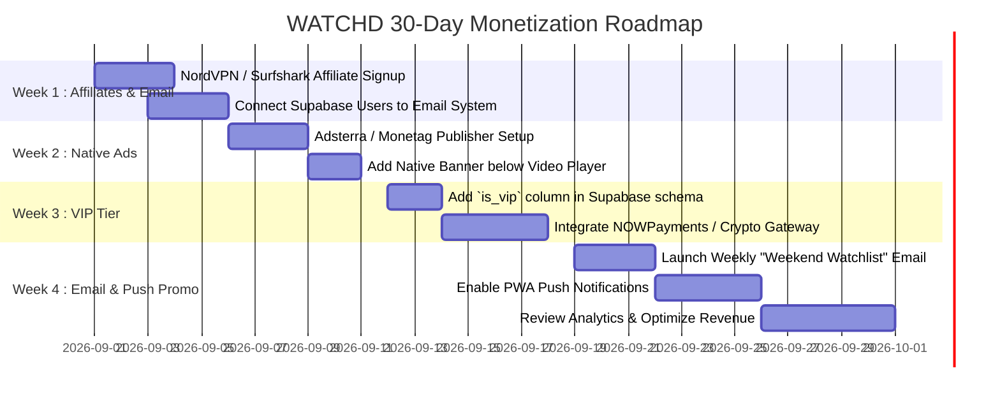

# 💰 WATCHD Monetization Blueprint & Strategy Guide

A comprehensive, step-by-step monetization guide tailored for the **WATCHD** streaming platform.

---

## 📑 Table of Contents
1. [Monetization Architecture Overview](#1-monetization-architecture-overview)
2. [Pillar 1: Affiliate Partnerships (Highest Margin)](#2-pillar-1-affiliate-partnerships-highest-margin)
3. [Pillar 2: High-CPM Streaming Ad Networks](#3-pillar-2-high-cpm-streaming-ad-networks)
4. [Pillar 3: WATCHD VIP / Premium Membership](#4-pillar-3-watchd-vip--premium-membership)
5. [Pillar 4: Push Notification & PWA Retention Monetization](#5-pillar-4-push-notification--pwa-retention-monetization)
6. [Strategic 30-Day Execution Plan](#6-strategic-30-day-execution-plan)

---

## 1. Monetization Architecture Overview

| Revenue Stream | Expected Monthly CPM / Payout | Setup Effort | User Friction |
| :--- | :--- | :--- | :--- |
| **VPN Affiliates** | **\$20 – \$40 per conversion** (40–100% rev-share) | Very Low | None (Adds Value) |
| **Native Banner Ads** | **\$1.50 – \$4.00 CPM** | Low | Low |
| **PWA Web Push Ads** | **\$2.00 – \$6.00 CPM** | Medium | Low (Runs in background) |
| **VIP Membership Tier** | **\$3.99 – \$4.99 / user / month** | Medium | Zero (Premium feature) |
| **Direct Crypto Tips** | **Variable (\$10 – \$100+ / mo)** | Very Low | None |

---

## 2. Pillar 1: Affiliate Partnerships (Highest Margin)

Streaming users are the **#1 consumer group** for VPNs, secure browsers, and cloud stream accelerators.

### A. Top VPN Affiliate Networks
1. **NordVPN Affiliate Program** (via CJ Affiliate or Impact):
   - **Commission**: 40% to 100% on new signups + 30% recurring renewals.
   - **Why it converts**: Top recognized brand for buffer-free streaming and geo-unblocking.
2. **Surfshark VPN Affiliate**:
   - **Commission**: 40% revenue share.
   - **Angle**: "Unlimited devices for the whole family".
3. **PureVPN / CyberGhost**:
   - **Commission**: Up to \$40 CPA per lead.

### B. High-Converting In-App Placements:
* **The "Pro Streaming Tip" Banner** (already present in `src/components/AdTipBanner.tsx`):
  ```html
  Pro Streaming Tip: For 100% buffer-free 4K streaming, protect your connection with NordVPN (70% Off Today) [Get Deal →]
  ```
* **Player Pre-stream Note**:
  A small badge below the video player: *"Streaming slow or blocked in your region? Use a high-speed VPN to unlock all servers."*

---

## 3. Pillar 2: High-CPM Streaming Ad Networks

Because traditional Google AdSense has strict policies regarding third-party embed players, use specialized, high-tier entertainment ad networks:

### A. Recommended Ad Networks
1. **Adsterra** ([adsterra.com](https://adsterra.com)):
   - **Best formats**: Native Banners (300x250, 728x90) and Social Bar.
   - **Payouts**: Fast bi-weekly payouts (PayPal, Crypto USDT, Wire, WebMoney).
2. **Monetag / PropellerAds** ([monetag.com](https://monetag.com)):
   - **Best formats**: In-Page Push notifications and Vignette banners.
   - **Advantage**: Fully optimized for mobile screens and PWA web apps.
3. **HilltopAds** ([hilltopads.com](https://hilltopads.com)):
   - High CPM for video streaming and entertainment traffic.

### B. Optimal Ad Layout (Zero User Frustration):
* **Placement 1**: One clean Native Banner (300x250 / 728x90) directly underneath the Video Player on the Watch Page.
* **Placement 2**: A non-intrusive bottom sticky banner on mobile/desktop with a quick close button.
* **Avoid**: Do NOT use 5+ aggressive popunders per click. Quality over spam ensures high return visitor retention.

---

## 4. Pillar 3: WATCHD VIP / Premium Membership

With **Supabase Auth** already integrated into WATCHD, you can offer a subscription tier.

### A. VIP Value Proposition (What Users Pay For):
1. ✨ **100% Ad-Free Experience**: Suppress all ad network banners/prompts for VIP accounts.
2. ⚡ **VIP Dedicated Ultra-Fast Video Servers**: Priority server selection.
3. 📥 **Direct Download Links**: Allow offline downloads for movies and episodes.
4. 👑 **Exclusive VIP Profile Badge**: Gold crown or VIP border on their avatar.

### B. Recommended Pricing:
* **Monthly Pass**: \$3.99 / month
* **Annual Pass**: \$29.99 / year (Best value)
* **Lifetime Pass**: \$49.99 (High upfront cash flow)

### C. Payment Gateways (Frictionless & Chargeback-Proof):
* **Crypto (NOWPayments / BTCPay Server / Coinbase Commerce)**:
  - Supports USDT, Bitcoin, Solana, Ethereum, Litecoin.
  - Zero chargebacks, global coverage, no merchant account bans.
* **Fiat Gateways**:
  - **Lemon Squeezy** / **Paddle** / **Paystack** (Africa/International) / **Stripe**.

### D. Supabase Implementation Example:
In your `profiles` table in Supabase, add:
```sql
ALTER TABLE profiles ADD COLUMN is_vip BOOLEAN DEFAULT FALSE;
ALTER TABLE profiles ADD COLUMN vip_expires_at TIMESTAMP WITH TIME ZONE;
```
When `user.is_vip === true`, the React UI hides all ad units and unlocks VIP server tabs.

---

## 5. Pillar 4: Email List Building & Promotional Monetization

Building an owned email list is one of the most profitable, long-term assets for a streaming platform. Unlike social media or search algorithms, you **own 100% of your subscriber list**.

### A. How to Collect High-Quality Emails on WATCHD:
1. **Supabase User Sign-Ups (Already Integrated)**:
   - Every user who signs in via **Google One-Tap, Social Auth, or Email Login** is automatically saved in your Supabase database (`auth.users` / `profiles`).
2. **"New Movie & Episode Drops" Newsletter Box**:
   - A clean subscription card in the footer or sidebar:
     > *"🎬 Never miss a 4K premiere! Get weekly alerts on trending movie drops & new episodes."*
3. **Watchlist Release Reminders**:
   - Allow users to opt in to email notifications when an unreleased movie in their watchlist premieres in HD.

---

### B. How to Monetize Your Email List:
1. **Weekly "Weekend Watchlist" Newsletter (Sponsored Content)**:
   - Send a weekly roundup of the top 5 trending movies on WATCHD.
   - Embed a featured sponsor link or VPN affiliate banner at the top of the email (*"Sponsored by NordVPN — Stream securely with 70% off"*).
2. **VIP Upgrade Promotional Campaigns**:
   - Automated drip campaigns for free users:
     - **Day 1**: Welcome email with trending recommendations.
     - **Day 3**: "Did you know you can watch 100% ad-free in 4K? Unlock WATCHD VIP for just \$3.99".
     - **Day 7**: Limited-time 30% discount on the VIP Annual Pass.
3. **Third-Party Affiliate Offers**:
   - Promote relevant entertainment products: Gaming gear, streaming hardware (FireStick / Apple TV), merch, and VPN subscriptions.

---

### C. Recommended Email Marketing Tools:
* **Brevo (formerly Sendinblue)**: Generous free tier (300 emails/day), reliable deliverability.
* **Resend** ([resend.com](https://resend.com)): Developer-friendly email API, perfect for React/Supabase webhooks.
* **MailerLite**: Excellent visual newsletter builder with automated workflows.

---

## 6. Pillar 5: Web Push Notification & PWA Mobile Monetization

Web Push Notifications allow WATCHD to send **native phone notifications directly through the browser** — **even when the user's browser is completely closed and their screen is locked**.

---

### A. How It Works on Mobile Devices:
1. **1-Tap Opt-In Prompt**: When visiting the site or installing the PWA, a notification prompt asks:
   > *"🎬 Allow notifications for instant alerts on new 4K movie drops & weekly episodes? [Allow]"*
2. **Native Phone Delivery**:
   - 🔔 **Sound & Vibration**: Rings like a native app alert.
   - 🖼️ **Large Media Thumbnails**: Displays the movie backdrop/poster thumbnail and the WATCHD Play icon.
   - 🔗 **Direct Tap-to-Play**: Tapping the notification opens WATCHD directly to the movie player in full-screen.

---

### B. Device & Browser Compatibility:
* **Android (Samsung, Pixel, Xiaomi, OnePlus, etc.)**: 100% supported in Chrome, Brave, Samsung Internet, Edge, Firefox, and Opera.
* **Apple iPhone & iPad (iOS 16.4+)**: Supported when the user adds WATCHD to their Home Screen (our PWA install prompt handles this automatically).
* **Desktop (Windows PC & Mac)**: Supported across all browsers.

---

### C. High-Converting Push Notification Templates:

#### 1. New 4K Blockbuster Release (Traffic Surge)
* **Title**: `🔥 New Premiere in 4K: Deadpool & Wolverine`
* **Body**: `Now available with instant HD streaming and subtitles on WATCHD! Tap to play.`
* **Action**: Links directly to `/watch/movie/533535`.

#### 2. TV Series New Episode Alert (Retention)
* **Title**: `📺 Arcane Season 2 — Episode 4 is Live!`
* **Body**: `Continue watching your favorite show now.`
* **Action**: Links to `/watch/tv/94605/2/4`.

#### 3. VIP Subscription Special Offer (Direct Revenue)
* **Title**: `⚡ Weekend Special: 50% Off WATCHD VIP`
* **Body**: `Enjoy 100% ad-free streaming & priority 4K servers for only $1.99.`
* **Action**: Links to `/watchlist` or VIP upgrade modal.

---

### D. Recommended Push Notification Platforms:

1. **OneSignal ([onesignal.com](https://onesignal.com))** *(Recommended)*:
   - **Free Plan**: Supports up to **10,000 active mobile subscribers**.
   - **Features**: Visual message composer, scheduled delivery, automated abandoned watchlist alerts, user segmenting.
   - **Integration**: Simple 2-file setup in `public/sw.js` and `index.html`.

2. **Monetag Web Push Ad Monetization**:
   - Sends 1–2 automated sponsored entertainment push alerts per day to opted-in users.
   - Generates steady passive daily revenue even when users are not on the site.

---

## 7. Strategic 30-Day Execution Plan



---

## 💡 Summary Checklist:
- [ ] Sign up for **NordVPN / Surfshark** Affiliate programs.
- [ ] Set up an automated email service (**Resend** or **Brevo**) connected to Supabase signups.
- [ ] Send weekly promotional & movie recommendation newsletters with affiliate links.
- [ ] Connect **Adsterra** or **Monetag** for native video player banners.
- [ ] Add a Crypto Donation / Tip button to the Footer and Profile Menu.
- [ ] Enable **WATCHD VIP** in Supabase for recurring subscription revenue.


